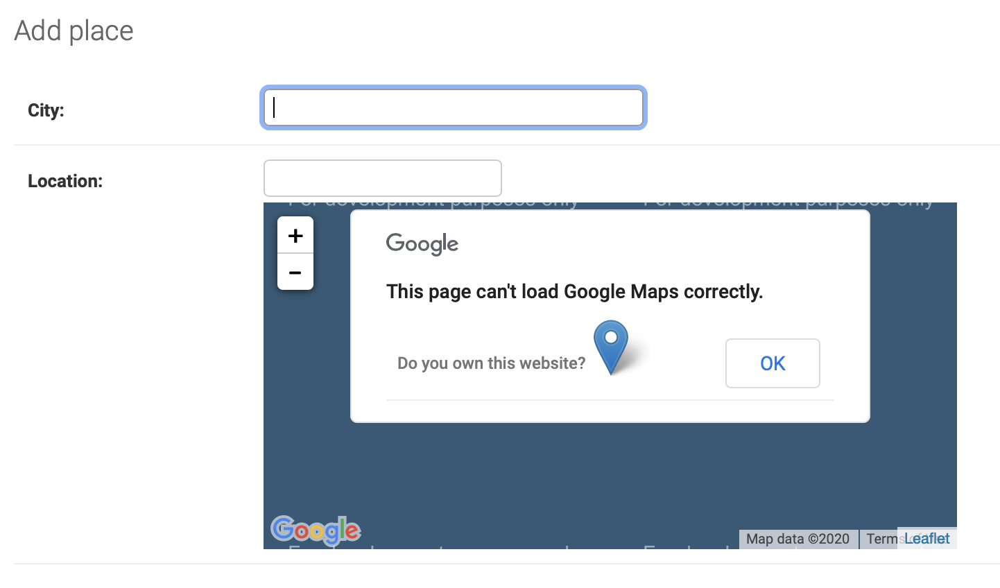
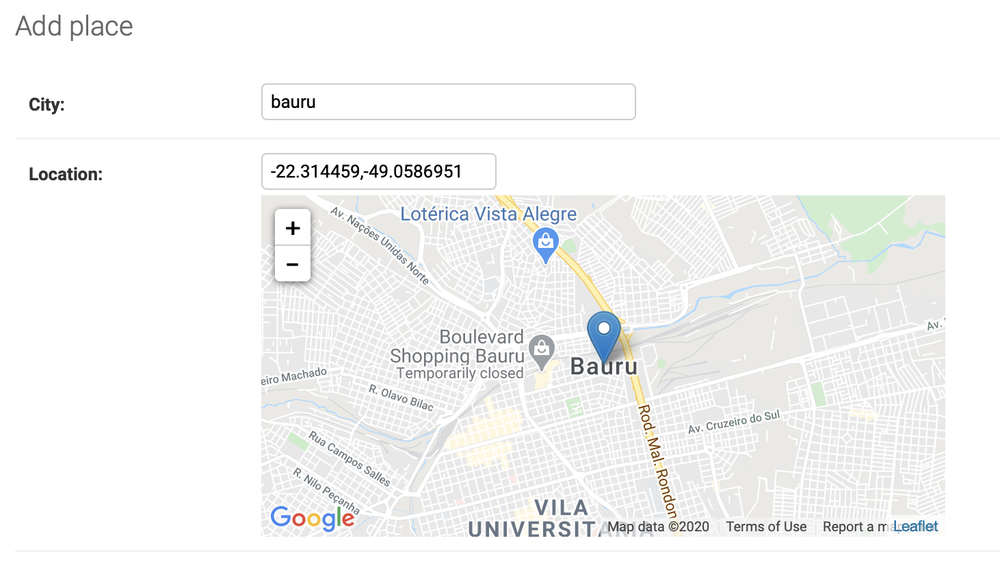

*********
Tutorials
*********

Using django-location-field in the Django admin
===============================================

.. contents:: Table of Contents
   :local:

Installation
------------

Using pip:

.. code:: bash

    python -m pip install django-location-field

Update your settings
--------------------

Example:

.. code:: python

    INSTALLED_APPS = [
        ...
        'django.contrib.messages',
        'django.contrib.staticfiles',
        'app',
        'location_field.apps.DefaultConfig',
    ]

Use one of the model fields (LocationField or PlainLocationField)
-----------------------------------------------------------------

Example:

.. code:: python

    from django.db import models
    from location_field.models.plain import PlainLocationField
    
    class Place(models.Model):
        city = models.CharField(max_length=255)
        location = PlainLocationField(based_fields=['city'], zoom=7)

Register your model in the admin
--------------------------------

Example:

.. code:: python

    from django.contrib import admin

    from .models import Place

    admin.site.register(Place)

.. note::

    You now should be able to see the map widget in the admin form. You will also notice
    that map is not loading correctly. This is because the default map provider is Google
    and it requires an API key.

Providing an API Key
--------------------

In your settings file, we need to provide the API key as shown below. Please notice that
this will change depending on the Map Provider you want to use. For other map providers,
please check the :ref:`Settings <settings>` page.

.. code:: python

    LOCATION_FIELD = {
        'provider.google.api': '//maps.google.com/maps/api/js?sensor=false',
        'provider.google.api_key': '<PLACE YOUR API KEY HERE>',
        'provider.google.api_libraries': '',
        'provider.google.map.type': 'ROADMAP',
    }

And now you should be able to see the map render correctly:

.. note::

    If you are not sure how to get the API key, one recommendation is to search for:
    ``<your api provider> api key`` (eg. "google maps api key"), using your favorite
    search engine :)

.. note::

    If your map still does not work as expected, look at the browser console. Usually
    Map Providers will use the console to communicate possible issues (billing, for example)
